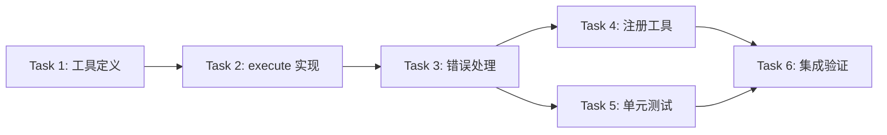

# Task List: Web Search Tool (DuckDuckGo)

**Feature Branch**: `008-web-search-tool`
**Created**: 2026-03-27
**Plan**: specs/008-web-search-tool/plan.md
**Status**: ✅ Completed

---

## Task 1: 创建工具定义文件

### 描述
创建 `src/tools/web-search.ts` 文件，定义 web_search 工具的基本结构和参数 schema。

### 文件
- `src/tools/web-search.ts` [新建] ✅

### 验收标准
- [x] 导入必要的依赖 (`@sinclair/typebox`)
- [x] 定义 `WebSearchParamsSchema`:
  - `query`: string, 必填
  - `maxResults`: number, 可选, 默认 5, 范围 1-10
- [x] 定义 `DuckDuckGoResponse` 接口，包含：
  - `Abstract`, `AbstractText`, `AbstractSource`, `AbstractURL`
  - `Heading`
  - `RelatedTopics` (Array of `{Text?, FirstURL?}`)
  - `Results` (Array of `{Text?, FirstURL?}`)
- [x] 定义 `WebSearchResult` 接口，包含：
  - `title`: string
  - `snippet`: string
  - `url`: string
  - `source?`: string
- [x] 导出 `webSearchTool` 对象，包含：
  - `name`: 'web_search'
  - `label`: '搜索网页'
  - `description`: '搜索网页信息，返回相关结果（使用 DuckDuckGo）'
  - `parameters`: WebSearchParamsSchema
  - `execute`: 函数占位符 (返回 "not implemented")

### 预计时间
15 分钟

---

## Task 2: 实现 execute 函数 - 核心逻辑

### 描述
实现 `execute` 函数的核心搜索逻辑，包括参数验证、API 调用和结果解析。

### 文件
- `src/tools/web-search.ts` [修改] ✅

### 验收标准
- [x] 参数验证:
  - 检查 query 非空，空则返回错误提示 "请提供搜索关键词"
  - 处理 maxResults 默认值 (5) 和边界值 (min=1, max=10)
- [x] URL 构建:
  ```typescript
  const url = `https://api.duckduckgo.com/?q=${encodeURIComponent(query)}&format=json&no_html=1&skip_disambig=1`;
  ```
- [x] HTTP 请求:
  - 使用 `fetch` API
  - 设置超时 10000ms
  - 支持 `AbortSignal` 传递
- [x] 响应解析:
  - 解析 JSON 响应
  - 提取 `Abstract` 和 `RelatedTopics`
  - 合并 `Results` 数组
- [x] 结果格式化:
  - 返回文本格式内容
  - 包含 `details` 元信息
- [x] TypeScript 类型正确，无编译错误

### 预计时间
30 分钟

---

## Task 3: 实现错误处理

### 描述
为 execute 函数添加完整的错误处理逻辑，覆盖各种异常场景。

### 文件
- `src/tools/web-search.ts` [修改] ✅

### 验收标准
- [x] 空查询处理: 返回 `{ content: [{ type: 'text', text: '请提供搜索关键词' }] }`
- [x] maxResults 边界处理:
  - `maxResults <= 0`: 自动修正为 1
  - `maxResults > 10`: 自动修正为 10
- [x] 网络错误处理: 返回 `{ content: [{ type: 'text', text: '搜索请求失败: {error.message}' }] }`
- [x] 超时处理: 返回 `{ content: [{ type: 'text', text: '搜索请求超时，请稍后重试' }] }`
- [x] API 返回异常: 返回 `{ content: [{ type: 'text', text: '搜索服务暂时不可用，请稍后重试' }] }`
- [x] 无结果处理: 返回 `{ content: [{ type: 'text', text: '未找到与 "{query}" 相关的结果' }] }`
- [x] AbortSignal 支持: 正确传递中止信号，可被外部中断
- [x] 所有错误路径都返回符合 ToolResult 接口的对象

### 预计时间
20 分钟

---

## Task 4: 注册工具到 index.ts

### 描述
在工具索引文件中导出 webSearchTool，使其可被系统发现和使用。

### 文件
- `src/tools/index.ts` [修改] ✅

### 验收标准
- [x] 导入 webSearchTool:
  ```typescript
  import { webSearchTool } from './web-search.js';
  ```
- [x] 在导出列表中添加:
  ```typescript
  export { webSearchTool };
  ```
- [x] 在 `getBuiltinTools()` 返回数组中添加 webSearchTool
- [x] 导入路径使用 `.js` 扩展名 (ESM 规范)
- [x] TypeScript 编译无错误
- [x] 运行时无模块加载错误

### 预计时间
5 分钟

---

## Task 5: 创建单元测试文件

### 描述
创建 `tests/unit/tools/web-search.test.ts`，编写完整的单元测试覆盖所有场景。

### 文件
- `tests/unit/tools/web-search.test.ts` [新建] ✅

### 验收标准
- [x] 测试文件结构:
  - `tool definition tests` 分组
  - `execute - 正常流程` 分组
  - `execute - 参数边界` 分组
  - `execute - 错误处理` 分组
  - `execute - 无结果场景` 分组
  - `execute - URL 编码` 分组
- [x] 工具定义测试 (3 个用例):
  - 验证工具名称为 'web_search'
  - 验证工具描述存在
  - 验证参数 schema 正确 (query 必填, maxResults 可选)
- [x] 正常流程测试 (3 个用例):
  - 返回抽象摘要
  - 返回相关主题列表
  - 遵守 maxResults 限制
- [x] 参数边界测试 (4 个用例):
  - 空查询返回错误提示
  - maxResults=0 自动修正为 1
  - maxResults>10 自动修正为 10
  - maxResults 默认值为 5
- [x] 错误处理测试 (5 个用例):
  - 网络错误返回友好提示
  - 超时返回友好提示
  - AbortSignal 正确传递
  - API 返回无效 JSON
  - API 返回空对象
- [x] 无结果场景测试 (2 个用例):
  - 冷门关键词无结果
  - 返回友好提示包含搜索词
- [x] URL 编码测试 (1 个用例):
  - 特殊字符和中文正确编码
- [x] Mock 策略:
  - 使用 `vi.fn()` mock `global.fetch`
  - 定义 `mockDDGResponse` 测试数据
  - 每个测试后清理 mock
- [x] 所有测试用例通过: `pnpm test tests/unit/tools/web-search.test.ts`
- [x] 测试覆盖率达标:
  - Statements >= 80%
  - Branches >= 75%
  - Functions >= 90%
  - Lines >= 80%

### 预计时间
40 分钟

---

## Task 6: 集成验证

### 描述
验证工具可以正确集成到 miniclaw 系统并被调用。

### 文件
- 无新文件

### 验收标准
- [x] TypeScript 编译通过: `pnpm build`
- [x] 所有测试通过: `pnpm test`
- [x] 工具可被 `getBuiltinTools()` 发现
- [x] 手动测试调用:
  ```typescript
  const result = await webSearchTool.execute('test-id', { query: 'Node.js' }, null);
  console.log(result);
  ```
- [x] 验证返回格式符合 ToolResult 接口

### 预计时间
10 分钟

---

## Summary

| 任务 | 预计时间 | 状态 |
|------|---------|------|
| Task 1: 创建工具定义文件 | 15 min | ✅ Completed |
| Task 2: 实现 execute 函数 | 30 min | ✅ Completed |
| Task 3: 实现错误处理 | 20 min | ✅ Completed |
| Task 4: 注册工具到 index.ts | 5 min | ✅ Completed |
| Task 5: 创建单元测试 | 40 min | ✅ Completed |
| Task 6: 集成验证 | 10 min | ✅ Completed |
| **总计** | **~2 小时** | **✅ Done** |

---

## Execution Order

推荐按以下顺序执行：

```
Task 1 → Task 2 → Task 3 → Task 4 → Task 5 → Task 6
```

Task 1-3 可以合并为一个 PR，Task 5 可以并行开发。
Task 6 必须在所有任务完成后执行。

---

## Dependencies



---

## Notes

- DuckDuckGo API 无需 API Key，但有隐式速率限制
- 适合轻量级搜索场景，不支持复杂搜索语法
- 中文搜索结果质量取决于 DuckDuckGo